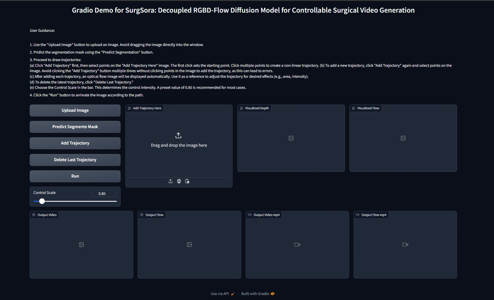

<div align="center">
<samp>
  
<h1> Object-Aware Diffusion Model for Controllable Surgical Video Generation
<be> (SurgSora) </h1>

<h4> <b>Tong Chen*, Shuya Yang*, Junyi Wang*</b>, Long Bai†, Hongliang Ren, and Luping Zhou† </h3>

<h4> Medical Image Computing and Computer Assisted Intervention (MICCAI) 2025 </h3>
</samp>

| **[[```arXiv```](<https://arxiv.org/abs/2412.14018>)]** |  **[[```Project Page```](<https://surgsora.github.io/>)]**|
|:-------------------:|:-------------------:|


</div>     

<p align="center">
  
</p>

## Update

· Oct/2025: 📢📢📢 Training Code Released!

· Jul/2025: 🎉🎉🎉 Our Work has been accepted by MICCAI 2025!

· Apr/2025: 🔥🔥🔥 SurgSora Gradio is online!


## Environment Setup

`pip install -r requirements.txt`

Install [SAM2](https://github.com/facebookresearch/sam2) follow this:
```
git clone https://github.com/facebookresearch/sam2.git && cd sam2

pip install -e .
```

## Training
stage 1
```
bash train_stage1.sh
```
stage 2
```
bash train_stage2.sh
```


## Download checkpoints

1. Download the pretrained checkpoint of [DAV2](https://huggingface.co/depth-anything/Depth-Anything-V2-Base/resolve/main/depth_anything_v2_vitb.pth) from huggingface to `./mdoels/dav2`.

2. Download the pretrained checkpoint of CMP from [here](https://huggingface.co/MyNiuuu/MOFA-Video-Traj/blob/main/models/cmp/experiments/semiauto_annot/resnet50_vip%2Bmpii_liteflow/checkpoints/ckpt_iter_42000.pth.tar) from huggingface to `./mdoels/cmp`.

The final structure of checkpoints should be:


```text
./models/
|-- DAV2
|-- CMP
|-- controlnet
|   |-- config.json
|   `-- diffusion_pytorch_model.safetensors
|-- stable-video-diffusion-img2vid-xt-1-1
|   |-- ...
|   `-- model_index.json
```

## Run Gradio Demo

`python gradio_demo_run.py`

<td align="center">
  
</td>
